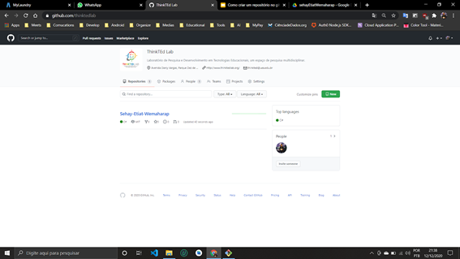

# Adicionando Projetos a Organização do ThinkTEd no GitHub

### Como criar um repositório GitHub e sincronizar com um projeto existente na máquina local ao repositório online

## Criando um repositório no GitHub

Antes de tudo lembre-se que você deve estar **logado** e **fazer parte da organização** para criar um repositório na organização. Para criar um novo repositório nesta organização entre na página da organização.



Depois clique no botão verde **new**, esta opção pode não estar ativada, caso não esteja, consulte algum dos administradores da organização. Após clicar no botão **new** a tela que se abre é a seguinte:


Nesta tela é preciso inserir alguns detalhes do repositório como o **nome do repositório, tipo público ou privado** (repositórios privados não estão disponíveis, caso necessite falar com o algum admin), é possível adicionar um arquivo **README.md** e um **.gitignore**, além da **licença do código**, porém estes três últimos são opcionais no momento da criação.

**Obs:** Recomenda-se que se adicione o **.gitignore** logo no início para evitar que arquivos não importantes sejam versionados.

### Adicionando um README.md ao projeto

Como explicado em uma  [resposta do Stackoverflow](https://pt.stackoverflow.com/questions/297006/qual-%C3%A9-a-import%C3%A2ncia-do-readme-md-no-git#:~:text=O%20README.md%20%C3%A9%20um,e%20exemplificar%2C%20o%20seu%20projeto.). "O README.md é um arquivo de texto utilizado para descrever o seu projeto. Ele é essencial se o seu projeto for público, ou seja, visa a criação e a participação de uma comunidade.

Ele nada mais é do que um arquivo de texto onde você poderá descrever, documentar e exemplificar, o seu projeto."

Para criar o arquivo automaticamente é só marcar a caixa de seleção apresentada.


É possível criar esse arquivo manualmente mais tarde caso decida, mas ele é bem importante como já comentado, então é sempre bom criá-lo no início.

### Adicionando um **.gitignore ao repositório**

Como explicado anteriormente [aqui](https://dev.to/dyhalmeida/para-que-serve-o-gitignore-e-o-gitkeep-39ln#:~:text=gitignore%20%C3%A9%20um%20arquivo%20que,para%20serem%20ignorados%20pelo%20git.). O **.gitignore** é um arquivo que criamos na raiz do nosso projeto para poder ignorar arquivos e pastas do versionamento. Dentro do **.gitignore** colocamos todos os arquivos e pastas para serem ignorados pelo git. Para adicioná-lo ao repositório no momento da criação basta marcar a caixa de seleção referente a esta opção.


Já existem arquivos pré-definidos para facilitar a nossa vida, para escolher algum desses arquivos basta clicar em cima da caixa que aparece ao selecionar a opção **Add .gitignore**. Ao realizar essa operação é aparece uma caixa de seleção para o tipo de projeto que estamos fazendo.


É possível realizar uma busca pelo tipo de projeto que estamos fazendo e o GitHub recomenda o tipo de **.gitignore** para o seu projeto. Neste exemplo o projeto é um jogo feito no Unity , então a busca foi feita pela palavra Unity.


### Adicionando uma licença ao projeto

De acordo com a documentação do GitHub. Os repositórios públicos no GitHub são usados frequentemente para compartilhar softwares de código aberto. Para que seu repositório seja realmente de código aberto, você precisará licenciá-lo para que outros tenham a liberdade de usar, alterar e distribuir o software. Para mais informações sobre licenças abra esse [link](https://docs.github.com/pt/free-pro-team@latest/github/creating-cloning-and-archiving-repositories/licensing-a-repository#:~:text=Os%20reposit%C3%B3rios%20p%C3%BAblicos%20no%20GitHub,alterar%20e%20distribuir%20o%20software.). Para adicionar uma licença marque a caixa de seleção e busque a licença desejada como na imagem abaixo


### Finalizado a criação do repositório

Por fim clique em **Create repository** para finalizar a criação do repositório online.


E então você verá uma tela parecida com a seguinte ao criar o repositório no GitHub.


## Sincronizando um repositório do GitHub com um projeto local

Para realizar a sincronização com um projeto local ao GitHub, é necessário que já tenha instalado o git em seu computador neste [link](https://git-scm.com/downloads) você pode encontra mais informações. Após o processo de instalação, é necessário que navegue até o diretório onde está o projeto que deseja ser sincronizado. 


Após entrar no diretório, abra um terminal do **Git Bash** para iniciar o processo de sincronização. 

Ao abrir o terminal, verá que o terminal está exatamente no diretório o qual foi instanciado o terminal. Em seguida digite o comando  para iniciar um repositório local.

```bash
$ git init 
```


Após utilizar o comando **git init**, será inicializado um repositório git vazio e criado uma **branch main** para o projeto. Em seguida será criado uma ligação entre o repositório local iniciado a um repositório no GitHub.


Para realizarmos o processo de sincronização com o repositório remoto do github é necessário saber para onde iremos mandar nossos arquivos. O comando  seguinte na imagem acima (**git remote add origin**) conecta o repositório local com o do GitHub. Mas para isso precisamos da url do repositório do GitHub. Para copiar esse endereço e dizer ao nosso repositório local para onde será feito o envio dos dados siga as instruções abaixo. 

### 1. Abra o repositório criado


### 2. Copie a url

Entre no seu usuário do GitHub e entre no repositório de destino no qual queria vincular seu projeto. Clique na opção **Code** no botão no canto superior.


Selecione a opção HTTPS e selecione a opção copiar ao lado do url (botão localizado ao lado do endereço https) para copiar o endereço desse repositório.

### 3. Cole a url junto ao comando

Com o link copiado, retorne para o git bash e cole esse link logo após o comando digitado anteriormente (podem ser feito de duas maneiras, clicando com o botão direito do mouse ou usando shift+insert).


 Depois pressione enter.


Pronto ! Após esse processo, sua tela deve se parecer com essa caso não tenha acontecido nenhum erro inesperado.

### Baixando os arquivos do Repositório Online para o Local

Digite o comando e depois pressione enter:

```bash
$ git pull origin main --allow-unrelated-histories
```

Você verá uma tela similar a esta.


### Visualizando o status do Repositório Local

Após ter realizado a sincronização entre os repositórios, é necessário verificar os arquivos criados no projeto e fazer com os mesmos sejam vistos pelo git, ou seja, que o git tenha acesso aos arquivos. Para isso usaremos o comando abaixo para verificar a situação atual do repositório local.

```bash
$ git status
```

Ao realizar este comando o git irá mostrar todos os arquivos que foram criados no projeto e que ainda não foram adicionados ao git. 


### Adicionando os arquivos do Repositório Local para serem versionados

Em seguida utilize o comando abaixo para adicionar todos os arquivos que ainda não foram adicionados ou todas as modificações realizadas dentro do projeto.

```bash
$ git add .
```

Após pressionar enter irá aparecer algo parecido com o a tela abaixo pra você.


Após usar o comando todos serão carregados e passaram a serem vistos pelo git.

Uma dica seria conferir para ver se realmente todos os arquivos foram adicionados para versionamento e não houveram erros, utilize o comando:

```bash
$ git status
```

Caso apareça uma tela parecida com a tela a seguir, significa que está tudo ok, todos passos foram seguidos com sucesso.


### Primeiro versionamento do Repositório Local

Em seguida é necessário realizar um **commit** dos arquivos para marcar uma versão do projeto e ter o controle de versões do projeto, por exemplo: criar um **commit** de quando finalizar um módulo de desenvolvimento, um script, funcionalidade entre outros. Para isso utilize o comando:

```bash
$ git commit -m "Mensagem de commit qualquer"
```


Neste exemplo foi realizado um commit inicial do projeto e foi passado uma mensagem de descrição da versão desse commit.


Feito! Em seguida sua tela ira mostrar que os arquivos estão sendo versionados/adicionados ao commit.

### Enviando os arquivos locais para o Repositório Online

Após os a finalização do commit, as alterações realizadas no projeto já podem ser enviadas para o repositório remoto, para isso utilize o comando:

```bash
$ git push origin main
```

Se você ainda não estiver logado ao git hub e ele pedir acesso, utilize os dados de login no qual o seu repositório no github foi criado e realize o login. 


Após ter carregado as modificações do projeto para o github, essa tela será mostrada caso não tenha ocorrido nenhum erro. Em seguida você pode voltar ao seu acesso do github no seu repositório e veras que ele irá ter uma nova alteração com seus dados do ultimo **commit** enviado.


Ao final, caso tenha algum problema encontrado alguma dificuldade ou esbarrado em algum problema que não consigas resolver, entre em contato com a nossa equipe de suporte!